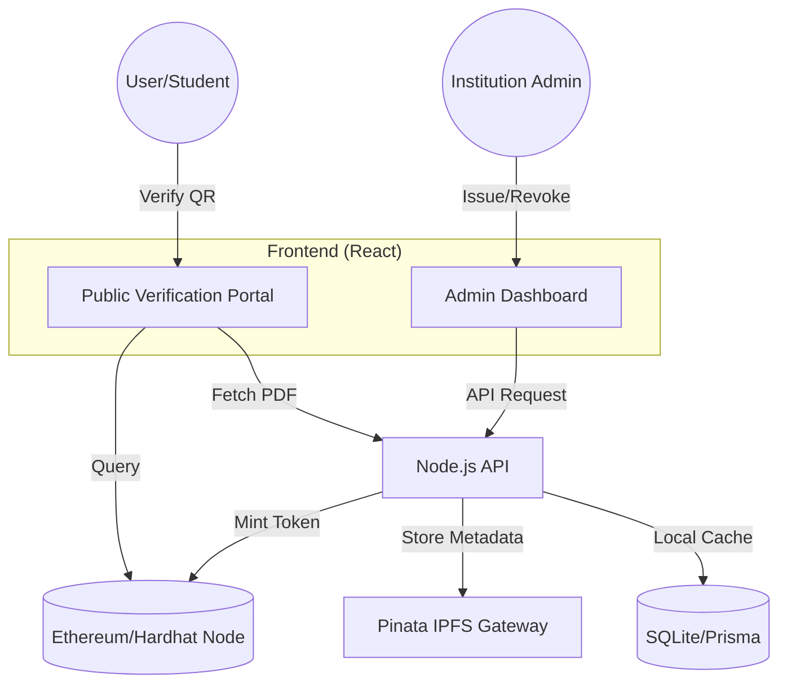

# 🛡️ SecureCert: Blockchain Credentialing System

<div align="center">
  <h3>Immutable trust for academic excellence.</h3>
  <p><i>A decentralized platform for issuing, managing, and verifying academic credentials with cryptographic certainty.</i></p>
</div>

---

## 🌟 Project Overview

**SecureCert** is a next-generation academic registry built to eliminate certificate fraud in educational institutions. By leveraging the **Ethereum Blockchain** and **IPFS**, SecureCert provides a tamper-proof record of student achievements that can be verified instantly by anyone, anywhere in the world.

### Key Pillars:
- **🔒 Immutability**: Once a certificate is issued, it cannot be altered or faked.
- **⚡ Instant Verification**: QR-code based verification eliminates manual background checks.
- **📂 Decentralized Storage**: Certificate metadata and documents are stored on IPFS, ensuring permanent availability.
- **📊 Admin Control**: Comprehensive dashboard for institutions to manage their credential lifecycle.

---

## 🚀 Quick Execution Guide

To get the full system running in a development environment, follow these four steps in separate terminal windows:

### 1. Start the Blockchain Node
```powershell
cd blockchain
npx hardhat node
```

### 2. Deploy the Smart Contract
```powershell
cd blockchain
npx hardhat run scripts/simple-deploy.js --network localhost
```

### 3. Launch the Backend API
```powershell
cd backend
node server.js
```

### 4. Launch the Frontend UI
```powershell
cd frontend
npm start
```

---

## 🏗️ System Architecture



---

## 🛠️ Technology Stack

| Layer | Technologies |
| :--- | :--- |
| **Frontend** | React 19, React Router 7, Ethers.js, Axios, CSS3 (Glassmorphism) |
| **Backend** | Node.js, Express, Prisma, PDF-Lib, QRCode, JWT, Bcrypt |
| **Blockchain** | Solidity, Hardhat, OpenZeppelin, Sepolia/Local Node |
| **Storage** | IPFS (Pinata), SQLite (Better-SQLite3) |

---

## 🎨 Premium Features

- **Award-Style PDF Generation**: Beautifully designed certificates with university-specific branding and security watermarks.
- **Cinematic Verification**: A premium, high-engagement verification portal with smooth animations and status indicators.
- **Bulk Issuance**: Support for CSV-based batch processing to issue hundreds of certificates in one transaction.
- **Dual Verification**: Hybrid check system that validates data against both the Blockchain ledger and IPFS metadata.
- **Institutional Branding**: Dynamic logo synchronization that automatically tailors certificate designs to the issuing university.

---

## 👥 Contributors & Acknowledgments

- **TIFE** - Lead Developer & Architect (made with love ❤️)
- **Isaacog12** - Project Lead
- **SecureCert Systems** - Inspiration and Branding

---

<div align="center">
  <p><i>This project was built as a proof-of-concept for the modernization of the Nigerian academic registry system.</i></p>
  <p><b>SecureCert © 2026</b></p>
</div>